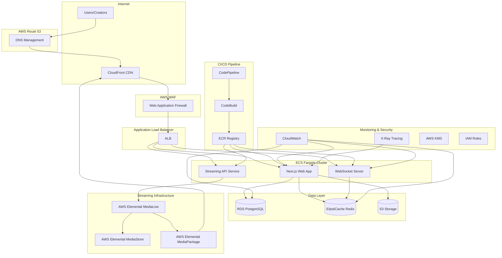

# Design Document

## Overview

This design document outlines the architecture for migrating the DirectFanz platform to a fully AWS-native infrastructure. The migration will transform the current deployment from a mixed Vercel/Docker setup to a comprehensive AWS solution leveraging ECS Fargate, RDS, ElastiCache, and other AWS services.

The design maintains all existing functionality while providing enhanced scalability, reliability, security, and cost optimization through AWS-native services.

## Architecture

### High-Level Architecture



### Network Architecture

The platform will use a multi-tier VPC architecture:

- **Public Subnets**: Application Load Balancer, NAT Gateways
- **Private Subnets**: ECS Fargate tasks, application services
- **Database Subnets**: RDS and ElastiCache instances (isolated)

Security groups will enforce least-privilege access between tiers.

## Components and Interfaces

### 1. Container Orchestration Layer

**ECS Fargate Cluster Configuration:**
- **Web Application Service**: Next.js application running on port 3000
- **WebSocket Service**: Real-time messaging server on port 3001
- **Streaming API Service**: Live streaming management service

**Service Specifications:**
```yaml
WebApp Service:
  CPU: 1024 (1 vCPU)
  Memory: 2048 MB
  Min Capacity: 2 tasks
  Max Capacity: 20 tasks
  Target CPU: 70%
  Target Memory: 80%

WebSocket Service:
  CPU: 512 (0.5 vCPU)
  Memory: 1024 MB
  Min Capacity: 2 tasks
  Max Capacity: 10 tasks
  Sticky Sessions: Enabled

Streaming Service:
  CPU: 2048 (2 vCPU)
  Memory: 4096 MB
  Min Capacity: 1 task
  Max Capacity: 5 tasks
```

**Application Load Balancer Configuration:**
- **Target Groups**: Separate groups for web app, WebSocket, and streaming API
- **Health Checks**: Custom health check endpoints for each service
- **SSL Termination**: AWS Certificate Manager certificates
- **Routing Rules**: Path-based routing for different services

### 2. Database Layer

**RDS PostgreSQL Configuration:**
- **Engine**: PostgreSQL 15.4
- **Instance Class**: db.r6g.large (production), db.t3.medium (staging)
- **Multi-AZ**: Enabled for high availability
- **Storage**: 100GB GP3 with auto-scaling to 1TB
- **Backup**: 30-day retention with point-in-time recovery
- **Performance Insights**: Enabled for query optimization
- **Connection Pooling**: PgBouncer integration

**Database Migration Strategy:**
1. Create RDS instance with same schema
2. Use AWS DMS for initial data migration
3. Implement application-level dual-write during cutover
4. Verify data consistency and switch read traffic
5. Complete cutover and decommission old database

### 3. Caching Layer

**ElastiCache Redis Configuration:**
- **Engine**: Redis 7.0
- **Node Type**: cache.r6g.large
- **Cluster Mode**: Enabled with 3 shards
- **Replicas**: 1 per shard for high availability
- **Encryption**: At-rest and in-transit encryption enabled
- **Auth Token**: Enabled for security

**Cache Usage Patterns:**
- **Session Storage**: User sessions and authentication tokens
- **API Response Caching**: Frequently accessed data
- **Real-time Data**: WebSocket connection state and live stream data
- **Rate Limiting**: API rate limiting counters

### 4. Content Storage and Delivery

**S3 Storage Configuration:**
- **Primary Bucket**: User-generated content (videos, images)
- **Static Assets Bucket**: Application static files
- **Backup Bucket**: Cross-region replication for disaster recovery
- **Lifecycle Policies**: Automatic transition to IA and Glacier
- **Versioning**: Enabled for critical content
- **Encryption**: SSE-S3 with AWS managed keys

**CloudFront CDN Configuration:**
- **Origin**: S3 buckets and ALB
- **Cache Behaviors**: Optimized for different content types
- **Edge Locations**: Global distribution
- **Signed URLs**: For private content access
- **Compression**: Automatic compression for text-based content

### 5. Live Streaming Infrastructure

**AWS Elemental MediaLive Setup:**
- **Input**: RTMP/WebRTC streams from creators
- **Output**: HLS and DASH formats for adaptive bitrate
- **Encoding**: Multiple bitrate ladder (240p to 1080p)
- **Integration**: Custom API for stream management

**AWS Elemental MediaStore:**
- **Storage**: Live stream segments and manifests
- **Access**: CORS-enabled for web player access
- **Lifecycle**: Automatic cleanup of old segments

**Streaming Workflow:**
1. Creator initiates stream through DirectFanz interface
2. MediaLive channel created with unique stream key
3. Stream ingested and transcoded to multiple bitrates
4. Segments stored in MediaStore
5. Manifest URLs provided to web players
6. Real-time chat handled via WebSocket service

### 6. Security Architecture

**AWS WAF Configuration:**
- **Rate Limiting**: Per-IP request limits
- **SQL Injection Protection**: Automated SQL injection detection
- **XSS Protection**: Cross-site scripting prevention
- **Geographic Blocking**: Optional country-based restrictions
- **Custom Rules**: Platform-specific security rules

**VPC Security:**
- **Network ACLs**: Subnet-level traffic control
- **Security Groups**: Service-level firewall rules
- **Private Subnets**: Database and cache isolation
- **VPC Endpoints**: S3 and other AWS service access without internet

**IAM Security:**
- **Service Roles**: Least-privilege roles for each service
- **Cross-Service Access**: Secure service-to-service communication
- **Secrets Management**: AWS Secrets Manager for sensitive data
- **Audit Logging**: CloudTrail for all API calls

### 7. Monitoring and Observability

**CloudWatch Configuration:**
- **Custom Metrics**: Business metrics (active users, streams, revenue)
- **Application Logs**: Centralized logging from all services
- **Alarms**: Automated alerting for critical thresholds
- **Dashboards**: Real-time operational visibility

**AWS X-Ray Integration:**
- **Distributed Tracing**: End-to-end request tracing
- **Performance Analysis**: Bottleneck identification
- **Error Analysis**: Exception tracking and analysis
- **Service Map**: Visual service dependency mapping

**Key Metrics to Monitor:**
- **Application**: Response time, error rate, throughput
- **Infrastructure**: CPU, memory, network utilization
- **Business**: Active users, concurrent streams, revenue
- **Security**: Failed authentication attempts, suspicious activity

### 8. CI/CD Pipeline

**CodePipeline Stages:**
1. **Source**: GitHub repository webhook trigger
2. **Build**: CodeBuild for testing and Docker image creation
3. **Staging Deploy**: Automated deployment to staging environment
4. **Manual Approval**: Human approval gate for production
5. **Production Deploy**: Blue-green deployment to production

**CodeBuild Configuration:**
- **Build Environment**: Docker-based build environment
- **Test Execution**: Unit tests, integration tests, security scans
- **Image Building**: Multi-stage Docker builds for optimization
- **ECR Push**: Automated image versioning and registry push

**Deployment Strategy:**
- **Blue-Green Deployment**: Zero-downtime deployments
- **Health Checks**: Automated health verification
- **Rollback Capability**: Automatic rollback on failure
- **Feature Flags**: Gradual feature rollout capability

## Data Models

### Database Schema Migration

The existing Prisma schema will be maintained with the following enhancements:

**Performance Optimizations:**
- **Indexing Strategy**: Additional indexes for AWS-specific query patterns
- **Connection Pooling**: PgBouncer configuration for connection management
- **Read Replicas**: Read-only replicas for analytics and reporting queries

**AWS-Specific Enhancements:**
```sql
-- New tables for AWS-specific functionality
CREATE TABLE aws_media_assets (
    id UUID PRIMARY KEY,
    content_id UUID REFERENCES content(id),
    s3_bucket VARCHAR(255),
    s3_key VARCHAR(500),
    cloudfront_url VARCHAR(500),
    media_live_channel_id VARCHAR(255),
    created_at TIMESTAMP DEFAULT NOW()
);

CREATE TABLE streaming_sessions (
    id UUID PRIMARY KEY,
    live_stream_id UUID REFERENCES live_streams(id),
    media_live_channel_arn VARCHAR(500),
    media_store_container VARCHAR(255),
    hls_manifest_url VARCHAR(500),
    dash_manifest_url VARCHAR(500),
    status VARCHAR(50),
    created_at TIMESTAMP DEFAULT NOW(),
    ended_at TIMESTAMP
);
```

### Cache Data Models

**Redis Data Structures:**
```javascript
// Session storage
session:{sessionId} = {
  userId: string,
  role: string,
  expiresAt: timestamp,
  permissions: array
}

// API response cache
api:cache:{endpoint}:{params_hash} = {
  data: object,
  cachedAt: timestamp,
  ttl: number
}

// Live stream state
stream:{streamId} = {
  status: string,
  viewerCount: number,
  chatMessages: array,
  streamKey: string
}

// Rate limiting
rate_limit:{userId}:{endpoint} = {
  count: number,
  resetAt: timestamp
}
```

## Error Handling

### Application-Level Error Handling

**Error Categories:**
1. **Client Errors (4xx)**: Invalid requests, authentication failures
2. **Server Errors (5xx)**: Application errors, service unavailability
3. **Infrastructure Errors**: AWS service failures, network issues
4. **Business Logic Errors**: Payment failures, content violations

**Error Response Format:**
```javascript
{
  error: {
    code: "ERROR_CODE",
    message: "Human-readable error message",
    details: {
      field: "specific field error",
      suggestion: "How to fix the error"
    },
    requestId: "unique-request-identifier",
    timestamp: "2024-01-01T00:00:00Z"
  }
}
```

### Infrastructure Error Handling

**Service Resilience Patterns:**
- **Circuit Breaker**: Prevent cascade failures between services
- **Retry Logic**: Exponential backoff for transient failures
- **Graceful Degradation**: Fallback functionality when services are unavailable
- **Health Checks**: Automated service health monitoring

**Database Error Handling:**
- **Connection Pool Management**: Handle connection exhaustion
- **Query Timeout**: Prevent long-running queries from blocking
- **Deadlock Detection**: Automatic deadlock resolution
- **Backup Restoration**: Automated point-in-time recovery procedures

**Streaming Error Handling:**
- **Stream Failure Recovery**: Automatic stream restart on failure
- **Encoding Errors**: Fallback to lower quality streams
- **Network Issues**: Adaptive bitrate adjustment
- **Storage Failures**: Redundant storage across availability zones

## Testing Strategy

### Dual Testing Approach

The testing strategy combines unit testing for specific functionality with property-based testing for comprehensive validation across all inputs.

**Unit Testing Focus:**
- **API Endpoints**: Request/response validation
- **Database Operations**: CRUD operations and transactions
- **Authentication**: Login, logout, and permission checks
- **Payment Processing**: Stripe integration and webhook handling
- **Content Upload**: File processing and S3 integration
- **Streaming**: MediaLive integration and stream management

**Property-Based Testing Focus:**
- **Data Integrity**: Database consistency across operations
- **API Contracts**: Response format consistency
- **Security**: Authentication and authorization properties
- **Performance**: Response time and throughput properties
- **Scalability**: System behavior under varying loads

**Testing Infrastructure:**
- **Test Environment**: Dedicated AWS environment mirroring production
- **Test Data**: Synthetic data generation for comprehensive testing
- **Load Testing**: Automated performance testing with realistic traffic patterns
- **Security Testing**: Automated vulnerability scanning and penetration testing

**Property-Based Test Configuration:**
- **Framework**: Jest with fast-check for JavaScript/TypeScript
- **Iterations**: Minimum 100 iterations per property test
- **Test Tagging**: Each test tagged with feature and property reference
- **Continuous Integration**: All tests run on every commit and deployment

## Correctness Properties

*A property is a characteristic or behavior that should hold true across all valid executions of a system—essentially, a formal statement about what the system should do. Properties serve as the bridge between human-readable specifications and machine-verifiable correctness guarantees.*

### Infrastructure Properties

**Property 1: Container High Availability**
*For any* ECS service configuration, the service should maintain at least the minimum required number of healthy tasks at all times, automatically replacing failed tasks within the specified recovery time
**Validates: Requirements 1.4, 1.5**

**Property 2: Auto-scaling Responsiveness**
*For any* AWS service with auto-scaling enabled (ECS, ElastiCache, RDS), when resource utilization exceeds defined thresholds, new capacity should be provisioned within the specified time limits
**Validates: Requirements 1.3, 3.5, 10.4, 12.5**

**Property 3: Zero-downtime Deployment**
*For any* deployment operation, the system should maintain service availability throughout the deployment process, with no dropped connections or service interruptions
**Validates: Requirements 1.7**

### Data Layer Properties

**Property 4: Database Schema Consistency**
*For any* database migration operation, all existing tables, columns, relationships, and constraints should be preserved and function identically to the pre-migration state
**Validates: Requirements 2.2**

**Property 5: Connection Pool Efficiency**
*For any* database connection request, the connection should be served from the pool when available, and new connections should only be created when the pool is exhausted, maintaining optimal resource utilization
**Validates: Requirements 2.7**

**Property 6: Backup Reliability**
*For any* 24-hour period, automated backups should be created successfully and retained according to the specified retention policy, with backup integrity verified
**Validates: Requirements 2.4**

**Property 7: Read Replica Consistency**
*For any* read operation that can be served by a replica, the data returned should be consistent with the primary database within acceptable replication lag limits
**Validates: Requirements 2.3**

### Caching Properties

**Property 8: Cache Operation Performance**
*For any* cache operation (GET, SET, DELETE), the response time should be sub-millisecond for 99% of operations under normal load conditions
**Validates: Requirements 3.6**

**Property 9: Cache Failover Integrity**
*For any* cache node failure scenario, the system should automatically failover to healthy nodes without losing cached session data or requiring user re-authentication
**Validates: Requirements 3.4**

**Property 10: Redis Compatibility**
*For any* existing Redis operation used by the application (sessions, caching, real-time data), the operation should function identically after migration to ElastiCache
**Validates: Requirements 3.2**

### Content and Storage Properties

**Property 11: File Type Support**
*For any* supported file type (video, image, document), the upload, storage, and retrieval process should work correctly with proper metadata preservation and content integrity
**Validates: Requirements 4.3**

**Property 12: CDN Caching Behavior**
*For any* static asset request, the CDN should serve cached content when available and apply appropriate TTL policies based on content type and caching rules
**Validates: Requirements 4.4**

**Property 13: Signed URL Security**
*For any* private content access request, signed URLs should provide time-limited access that expires correctly and prevents unauthorized access after expiration
**Validates: Requirements 4.6**

**Property 14: Lifecycle Policy Automation**
*For any* content object stored beyond the specified age threshold, the lifecycle policy should automatically transition the object to the appropriate storage class
**Validates: Requirements 4.5**

### Streaming Properties

**Property 15: Adaptive Bitrate Streaming**
*For any* live stream, multiple bitrate variants should be available to clients, allowing adaptive quality selection based on network conditions
**Validates: Requirements 5.3**

**Property 16: Stream Chat Integration**
*For any* active live stream, the WebSocket-based chat functionality should remain operational and synchronized with the stream state
**Validates: Requirements 5.4**

**Property 17: Stream Recording Consistency**
*For any* live stream that is configured for recording, the system should create a VOD asset that accurately represents the live stream content
**Validates: Requirements 5.5**

**Property 18: Stream Access Control**
*For any* stream access request, the system should verify user authentication and permissions before granting access to the stream
**Validates: Requirements 5.6**

**Property 19: Real-time Analytics**
*For any* active stream, viewer metrics and analytics should be updated in real-time and accurately reflect current stream state
**Validates: Requirements 5.7**

### Monitoring Properties

**Property 20: Metrics Collection Completeness**
*For any* defined application, infrastructure, or business metric, the monitoring system should collect and store the metric data with appropriate granularity and retention
**Validates: Requirements 7.3**

**Property 21: Alert Trigger Accuracy**
*For any* monitored threshold breach, the alerting system should trigger notifications within the specified time window and route them to the correct recipients
**Validates: Requirements 7.4**

**Property 22: Log Retention and Search**
*For any* log entry within the retention period, the log should be searchable and retrievable through the monitoring interface
**Validates: Requirements 7.6**

### CI/CD Properties

**Property 23: Pipeline Trigger Reliability**
*For any* code change pushed to the monitored repository branches, the CI/CD pipeline should trigger automatically and execute all defined stages
**Validates: Requirements 8.3**

**Property 24: Test Execution Completeness**
*For any* pipeline execution, all configured test suites (unit, integration, e2e) should run successfully before proceeding to deployment stages
**Validates: Requirements 8.4**

**Property 25: Image Build and Registry**
*For any* successful build stage, Docker images should be created with proper versioning and pushed to ECR with appropriate tags and metadata
**Validates: Requirements 8.5**

**Property 26: Deployment Approval Workflow**
*For any* production deployment request, the system should require and wait for manual approval before proceeding with the deployment
**Validates: Requirements 8.7**

### DNS and Domain Properties

**Property 27: Health Check Failover**
*For any* service endpoint health check failure, DNS routing should automatically redirect traffic to healthy endpoints within the specified failover time
**Validates: Requirements 9.3**

**Property 28: Subdomain Routing**
*For any* configured subdomain, DNS resolution should correctly route requests to the appropriate service endpoints
**Validates: Requirements 9.4**

**Property 29: DNS Load Balancing**
*For any* service with multiple endpoints, DNS-based load balancing should distribute requests across available endpoints according to the configured algorithm
**Validates: Requirements 9.6**

### Cost Optimization Properties

**Property 30: Storage Tiering Optimization**
*For any* S3 object, intelligent tiering should automatically move objects to the most cost-effective storage class based on access patterns
**Validates: Requirements 10.2**

**Property 31: Cost Anomaly Detection**
*For any* significant deviation from expected cost patterns, the monitoring system should detect the anomaly and trigger appropriate alerts
**Validates: Requirements 10.5**

**Property 32: Cache Hit Rate Optimization**
*For any* CDN-served content, the cache hit rate should meet or exceed the specified threshold, minimizing origin server requests
**Validates: Requirements 10.6**

### Migration Properties

**Property 33: Data Migration Integrity**
*For any* data migration operation, the migrated data should maintain complete integrity with source data, verified through checksums and record counts
**Validates: Requirements 11.1, 11.2**

**Property 34: Migration Progress Tracking**
*For any* migration operation, progress should be accurately tracked and reported, with milestone completion status clearly indicated
**Validates: Requirements 11.6**

**Property 35: Migration Rollback Capability**
*For any* migration phase, rollback procedures should be available and tested, allowing safe reversion to the previous state if needed
**Validates: Requirements 11.5**

**Property 36: Data Integrity Validation**
*For any* migration milestone, automated data integrity checks should verify that all data remains consistent and accessible
**Validates: Requirements 11.7**

### Performance Properties

**Property 37: API Response Time**
*For any* API endpoint under normal load conditions, response times should remain below the specified threshold for the required percentile of requests
**Validates: Requirements 12.1**

**Property 38: Concurrent User Scalability**
*For any* user load within the specified range, the system should maintain performance and functionality without degradation
**Validates: Requirements 12.2**

**Property 39: Database Query Performance**
*For any* database query under normal conditions, response times should meet the specified percentile requirements
**Validates: Requirements 12.4**

**Property 40: Streaming Scalability**
*For any* number of concurrent streams within platform capacity, the streaming service should maintain quality and performance for all streams
**Validates: Requirements 12.6**

**Property 41: System Availability**
*For any* measured time period, the platform should maintain the specified uptime percentage, with downtime only during planned maintenance windows
**Validates: Requirements 12.7**