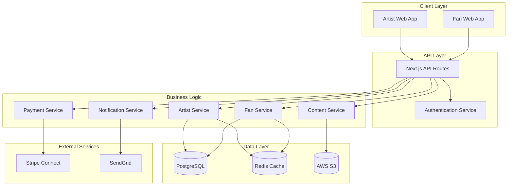

# Design Document

## Overview

The Direct-to-Fan Music Platform is a web-based application that connects independent artists with their fans through subscription-based content access. The platform integrates with Stripe for payments and uses modern web technologies for scalable deployment. The architecture follows a full-stack Next.js approach with clear separation between artist and fan experiences.

## Architecture

### High-Level Architecture



### Technology Stack

- **Frontend**: Next.js 14 with React 18, Tailwind CSS for styling
- **Backend**: Next.js API routes with serverless functions
- **Database**: PostgreSQL for relational data, Redis for caching and sessions
- **Storage**: AWS S3 for media files with CloudFront CDN
- **Authentication**: NextAuth.js with JWT tokens
- **Payments**: Stripe Connect with webhooks
- **Email**: SendGrid for transactional emails
- **Infrastructure**: Vercel deployment with serverless functions

## Components and Interfaces

### Core Components

#### 1. Authentication System
- **NextAuth.js Integration**: Handles email/password and OAuth providers
- **Role-based Access Control**: Distinguishes between artist and fan permissions
- **JWT Token Management**: Secure session handling with refresh tokens

#### 2. Artist Dashboard
- **Tier Management Interface**: CRUD operations for subscription tiers
- **Content Upload System**: Multi-file upload with progress tracking
- **Analytics Dashboard**: Revenue tracking and subscriber metrics
- **Profile Management**: Artist branding and bio customization

#### 3. Fan Experience
- **Artist Discovery**: Searchable artist directory with filtering
- **Subscription Management**: Stripe-powered checkout and billing
- **Content Access**: Gated content with streaming and download capabilities
- **Community Features**: Commenting and interaction systems

#### 4. Payment Processing
- **Stripe Connect Integration**: Artist onboarding and payout management
- **Webhook Handlers**: Real-time payment event processing
- **Subscription Logic**: Proration handling for tier changes

#### 5. Content Management
- **File Upload Service**: S3 integration with presigned URLs
- **Access Control**: Tier-based content gating
- **Media Processing**: Audio/video optimization and thumbnail generation

### API Design

#### Authentication Endpoints
```
POST /api/auth/signin
POST /api/auth/signup
POST /api/auth/signout
GET  /api/auth/session
```

#### Artist Endpoints
```
GET    /api/artist/profile
PUT    /api/artist/profile
GET    /api/artist/tiers
POST   /api/artist/tiers
PUT    /api/artist/tiers/:id
DELETE /api/artist/tiers/:id
GET    /api/artist/analytics
POST   /api/artist/content/upload
GET    /api/artist/content
PUT    /api/artist/content/:id
DELETE /api/artist/content/:id
```

#### Fan Endpoints
```
GET  /api/fan/artists
GET  /api/fan/artists/:id
POST /api/fan/subscribe
GET  /api/fan/subscriptions
PUT  /api/fan/subscriptions/:id
DELETE /api/fan/subscriptions/:id
GET  /api/fan/content/:artistId
POST /api/fan/comments
```

#### Payment Endpoints
```
POST /api/payments/create-checkout
POST /api/payments/webhooks
GET  /api/payments/portal
```

## Data Models

### User Model
```typescript
interface User {
  id: string
  email: string
  role: 'artist' | 'fan'
  profile: UserProfile
  createdAt: Date
  updatedAt: Date
}

interface UserProfile {
  displayName: string
  bio?: string
  avatar?: string
  socialLinks?: Record<string, string>
}
```

### Artist Model
```typescript
interface Artist extends User {
  stripeAccountId?: string
  isStripeOnboarded: boolean
  tiers: Tier[]
  content: Content[]
  analytics: ArtistAnalytics
}

interface Tier {
  id: string
  artistId: string
  name: string
  description: string
  minimumPrice: number
  isActive: boolean
  subscriberCount: number
  createdAt: Date
}
```

### Content Model
```typescript
interface Content {
  id: string
  artistId: string
  title: string
  description?: string
  type: 'audio' | 'video' | 'image' | 'document'
  fileUrl: string
  thumbnailUrl?: string
  tierIds: string[]
  isPublic: boolean
  metadata: ContentMetadata
  createdAt: Date
}

interface ContentMetadata {
  fileSize: number
  duration?: number
  format: string
  tags: string[]
}
```

### Subscription Model
```typescript
interface Subscription {
  id: string
  fanId: string
  artistId: string
  tierId: string
  stripeSubscriptionId: string
  amount: number
  status: 'active' | 'canceled' | 'past_due'
  currentPeriodStart: Date
  currentPeriodEnd: Date
  createdAt: Date
}
```

## Error Handling

### Error Categories
1. **Authentication Errors**: Invalid credentials, expired tokens
2. **Authorization Errors**: Insufficient permissions, tier access violations
3. **Payment Errors**: Failed transactions, webhook processing failures
4. **Upload Errors**: File size limits, unsupported formats
5. **System Errors**: Database connectivity, external service failures

### Error Response Format
```typescript
interface ErrorResponse {
  error: {
    code: string
    message: string
    details?: Record<string, any>
  }
  timestamp: string
  requestId: string
}
```

### Error Handling Strategy
- **Client-side**: Toast notifications for user-facing errors
- **Server-side**: Structured logging with error tracking
- **Payment Failures**: Automatic retry logic with exponential backoff
- **File Uploads**: Resumable uploads with progress recovery

## Testing Strategy

### Unit Testing
- **Components**: React Testing Library for UI components
- **API Routes**: Jest for endpoint testing with mocked dependencies
- **Services**: Isolated testing of business logic
- **Utilities**: Pure function testing for helpers and validators

### Integration Testing
- **Payment Flows**: Stripe test mode integration
- **File Uploads**: S3 mock integration testing
- **Authentication**: End-to-end auth flow testing
- **Database Operations**: Test database with transaction rollback

### End-to-End Testing
- **User Journeys**: Playwright for critical user paths
- **Artist Onboarding**: Complete tier creation and content upload
- **Fan Subscription**: Discovery to payment completion
- **Content Access**: Subscription verification and content delivery

### Performance Testing
- **Load Testing**: Concurrent user simulation
- **File Upload**: Large file handling and progress tracking
- **Database Queries**: Query optimization and indexing validation
- **CDN Performance**: Content delivery speed testing

## Security Considerations

### Authentication & Authorization
- JWT tokens with short expiration and refresh mechanism
- Role-based access control with middleware validation
- OAuth integration with secure token handling

### Data Protection
- GDPR compliance with user consent management
- Data encryption at rest (database) and in transit (HTTPS)
- PII data minimization and secure deletion

### Payment Security
- PCI compliance through Stripe integration
- Webhook signature verification
- Secure API key management

### Content Security
- Presigned URLs for secure file access
- Content access validation per request
- Rate limiting on API endpoints

## Deployment & Infrastructure

### Local Development
- Docker Compose for PostgreSQL and Redis services
- Environment variables via .env.local files
- Hot reloading with Next.js development server

### Production Deployment
- Vercel for Next.js application hosting
- Vercel Postgres for database (or external PostgreSQL provider)
- Upstash Redis for caching and sessions
- AWS S3 with CloudFront for media storage and delivery

### Environment Configuration
- Separate environments for development, staging, and production
- Secure environment variable management
- Database migrations and seeding scripts

### Monitoring & Observability
- Vercel Analytics for performance monitoring
- Sentry for error tracking and alerting
- Custom logging with structured JSON format
- Stripe Dashboard for payment monitoring

### Scaling Considerations
- Vercel's automatic scaling for serverless functions
- Database connection pooling with PgBouncer
- CDN configuration for global content delivery
- Redis clustering for high availability