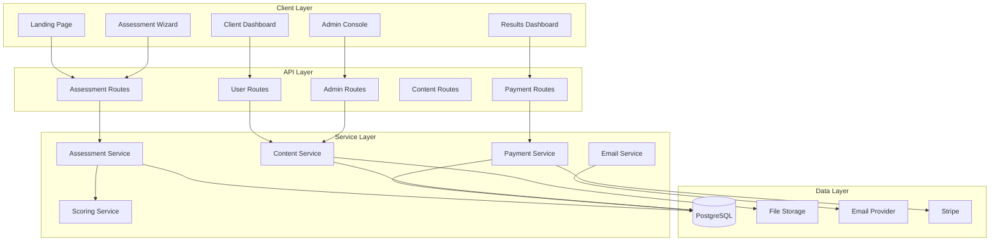

# Design Document

## Overview

The Queen Ash Enterprise Wellness Platform is designed as a comprehensive
wellness assessment and program delivery system built on Next.js with a focus on
user experience, scalability, and admin flexibility. The platform follows a
progressive disclosure pattern, guiding users from initial assessment through
paid consultations to program enrollment, while providing robust admin tools for
content management and business analytics.

The architecture leverages the existing Next.js/Prisma/Stripe foundation while
extending it with wellness-specific functionality including multi-domain
assessments, scoring algorithms, program content delivery, and automated email
sequences.

## Architecture

### System Architecture



### Data Flow

1. **Assessment Flow**: User completes multi-step wizard → Responses stored →
   Scoring engine calculates results → Results displayed with upgrade options
2. **Payment Flow**: User selects upgrade → Stripe checkout → Payment
   confirmation → Scheduler access granted
3. **Program Flow**: User enrolls → Content unlocked progressively → Email
   sequences triggered → Progress tracked
4. **Admin Flow**: Content updates → Real-time platform changes → Analytics
   dashboard → Lead management

## Components and Interfaces

### Core Components

#### Assessment System

- **AssessmentWizard**: Multi-step form component with progress tracking
- **QuestionRenderer**: Dynamic question display based on question type
- **ProgressBar**: Visual progress indicator with step validation
- **ScoreCalculator**: Algorithm engine for computing domain and composite
  scores
- **ResultsDisplay**: Score visualization with charts and recommendations

#### Payment Integration

- **StripeCheckout**: Secure payment processing with bundle upsells
- **PaymentSuccess**: Confirmation page with next steps
- **SchedulerEmbed**: Appointment booking integration
- **InvoiceManager**: Payment tracking and receipt generation

#### Program Delivery

- **ProgramDashboard**: Week-by-week content navigation
- **ContentViewer**: Multi-media content display (video, audio, documents)
- **ProgressTracker**: Completion status and milestone tracking
- **ActionItems**: Task lists and habit tracking

#### E-commerce

- **ProductCatalog**: SKU display with filtering and search
- **ShoppingCart**: Cart management with quantity controls
- **OrderManagement**: Purchase history and fulfillment tracking

#### Admin Console

- **ContentBlockEditor**: WYSIWYG editor for dynamic content
- **LeadManagement**: User journey tracking and conversion analytics
- **AppointmentScheduler**: Calendar management and booking oversight
- **AnalyticsDashboard**: Business metrics and performance tracking

### API Interfaces

#### Assessment API

```typescript
interface AssessmentAPI {
  // Start new assessment
  POST /api/assessment/start

  // Save assessment responses
  POST /api/assessment/responses

  // Calculate and retrieve scores
  GET /api/assessment/scores/:userId

  // Get assessment questions by domain
  GET /api/assessment/questions/:domain
}
```

#### Payment API

```typescript
interface PaymentAPI {
  // Create checkout session
  POST /api/payments/checkout

  // Handle webhook events
  POST /api/payments/webhooks

  // Get payment status
  GET /api/payments/status/:sessionId
}
```

#### Program API

```typescript
interface ProgramAPI {
  // Get program content
  GET /api/programs/:programId/weeks/:weekNumber

  // Update progress
  POST /api/programs/:programId/progress

  // Get user's programs
  GET /api/user/programs
}
```

## Data Models

### Extended User Models

```typescript
// Extend existing User model
interface WellnessUser extends User {
  profileAttributes: ProfileAttributes;
  assessmentResponses: AssessmentResponse[];
  assessmentScores: AssessmentScore[];
  appointments: Appointment[];
  programEnrollments: ProgramEnrollment[];
  orders: Order[];
}

interface ProfileAttributes {
  id: string;
  userId: string;
  demographics: Json; // Age, location, etc.
  bloodType?: string;
  healthGoals: string[];
  consentGiven: boolean;
  consentDate: DateTime;
  createdAt: DateTime;
  updatedAt: DateTime;
}

interface AssessmentResponse {
  id: string;
  userId: string;
  questionId: string;
  domain: AssessmentDomain; // SPIRIT, BODY, LIFESTYLE
  response: Json; // Flexible response format
  completedAt: DateTime;
}

interface AssessmentScore {
  id: string;
  userId: string;
  domain: AssessmentDomain;
  rawScore: number;
  normalizedScore: number;
  percentile: number;
  recommendations: string[];
  calculatedAt: DateTime;
}
```

### Business Models

```typescript
interface Offer {
  id: string;
  name: string;
  description: string;
  price: number;
  type: OfferType; // CONSULT, PROGRAM, BUNDLE
  stripeProductId: string;
  stripePriceId: string;
  isActive: boolean;
  features: string[];
  createdAt: DateTime;
  updatedAt: DateTime;
}

interface Order {
  id: string;
  userId: string;
  offerId: string;
  stripeSessionId: string;
  status: OrderStatus;
  amount: number;
  fulfillmentStatus: FulfillmentStatus;
  createdAt: DateTime;
  updatedAt: DateTime;
}

interface Appointment {
  id: string;
  userId: string;
  orderId: string;
  scheduledAt: DateTime;
  duration: number;
  status: AppointmentStatus;
  meetingLink?: string;
  notes?: string;
  createdAt: DateTime;
  updatedAt: DateTime;
}

interface Program {
  id: string;
  name: string;
  description: string;
  totalWeeks: number;
  isActive: boolean;
  weeks: ProgramWeek[];
  createdAt: DateTime;
  updatedAt: DateTime;
}

interface ProgramWeek {
  id: string;
  programId: string;
  weekNumber: number;
  title: string;
  description: string;
  content: Json; // Flexible content structure
  actionItems: string[];
  isUnlocked: boolean;
}

interface ProductSKU {
  id: string;
  name: string;
  description: string;
  price: number;
  inventory: number;
  stripeProductId: string;
  stripePriceId: string;
  images: string[];
  isActive: boolean;
  createdAt: DateTime;
  updatedAt: DateTime;
}
```

### Content Management

```typescript
interface ContentBlock {
  id: string;
  key: string; // Unique identifier for content placement
  title: string;
  content: Json; // Rich text, images, videos
  page: string; // Which page this content appears on
  section: string; // Which section of the page
  isActive: boolean;
  createdAt: DateTime;
  updatedAt: DateTime;
}

interface SystemSetting {
  id: string;
  key: string;
  value: Json;
  description: string;
  category: string;
  updatedAt: DateTime;
}
```

## Error Handling

### Error Categories

1. **Validation Errors**: Input validation failures with specific field feedback
2. **Payment Errors**: Stripe integration failures with user-friendly messages
3. **Assessment Errors**: Scoring calculation failures with fallback mechanisms
4. **Content Errors**: Missing or corrupted content with graceful degradation
5. **System Errors**: Database or service failures with retry mechanisms

### Error Response Format

```typescript
interface ErrorResponse {
  error: {
    code: string;
    message: string;
    details?: Record<string, any>;
    timestamp: string;
    requestId: string;
  };
}
```

### Error Handling Strategies

- **Client-side**: Form validation with real-time feedback
- **API-level**: Comprehensive error catching with structured responses
- **Payment**: Stripe error mapping to user-friendly messages
- **Assessment**: Graceful degradation when scoring fails
- **Content**: Fallback content when dynamic content is unavailable

## Testing Strategy

### Unit Testing

- **Assessment Logic**: Scoring algorithms and question rendering
- **Payment Integration**: Stripe webhook handling and order processing
- **Content Management**: CRUD operations and content validation
- **Email Automation**: Sequence triggering and template rendering

### Integration Testing

- **Assessment Flow**: End-to-end wizard completion and scoring
- **Payment Flow**: Checkout process through fulfillment
- **Program Access**: Content unlocking and progress tracking
- **Admin Operations**: Content updates and analytics accuracy

### E2E Testing

- **User Journeys**: Complete flows from landing to program enrollment
- **Payment Processing**: Real Stripe test transactions
- **Email Sequences**: Automated email triggering and delivery
- **Admin Workflows**: Content management and user administration

### Performance Testing

- **Assessment Load**: 500 concurrent users completing assessments
- **Payment Processing**: High-volume checkout scenarios
- **Content Delivery**: Media streaming and download performance
- **Database Queries**: Optimization for complex scoring calculations

### Security Testing

- **Data Protection**: PII handling and consent management
- **Payment Security**: PCI compliance verification
- **Authentication**: Session management and role-based access
- **Input Validation**: SQL injection and XSS prevention

## Implementation Considerations

### Scalability

- Database indexing for assessment queries
- CDN integration for media content
- Redis caching for frequently accessed data
- Horizontal scaling preparation for high traffic

### Accessibility

- WCAG AA compliance across all components
- Screen reader compatibility for assessment wizard
- Keyboard navigation support
- High contrast mode support

### Internationalization

- UTF-8 support for diverse user content
- Timezone handling (default America/Chicago)
- Currency formatting for payments
- Email template localization preparation

### Demo Mode

- Feature flag system for placeholder content
- Real-time content editing capabilities
- Stakeholder walkthrough optimization
- Easy transition from demo to production
